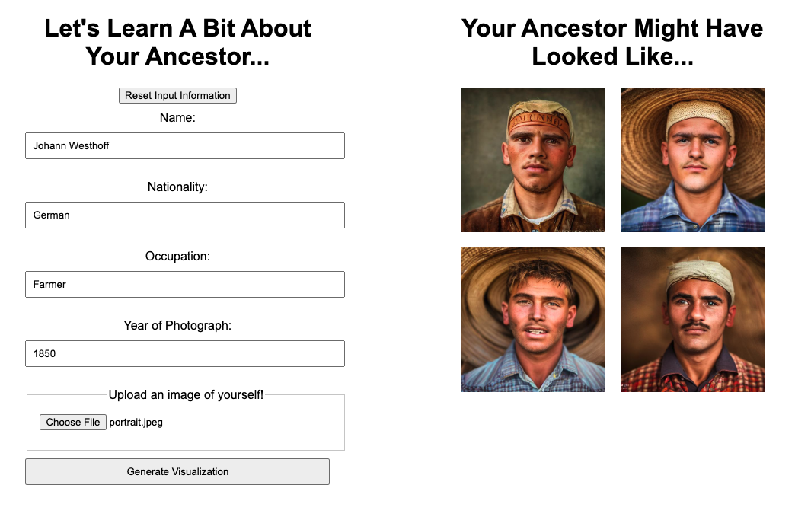

# Maybe Ancestors

## Overview

"Maybe Ancestors" is a fascinating web application that invites users to explore what their ancestors might have looked like, based on historical and personal data inputs. This project utilizes advanced machine learning techniques to generate potential ancestral portraits, offering a unique blend of history, genealogy, and AI-driven art.

## How It Works

The application is simple to use. Users are prompted to input specific details about their ancestor, such as name, nationality, occupation, and the year of the photograph they wish to recreate. Additionally, users can upload an image of themselves, which the AI uses as a basis for generating the ancestral portraits.

### Steps to Generate Ancestral Portraits:

1. **Input Ancestor's Details:** Fill in the form with the ancestor's name, nationality, occupation, and the year of the photograph.
2. **Upload Your Image:** Provide an image of yourself. This helps the AI model to create a more personalized result.
3. **Generate Visualization:** Click on the 'Generate Visualization' button to start the AI process.
4. **View Results:** The application will display a series of images that are AI-generated interpretations of what your ancestor might have looked like.

### Example Output

Here's an example of what the application can generate:

*Note: The generated images are artistic interpretations and not actual historical representations.*

## Technologies Used

- **Front-End:** HTML, CSS, JavaScript (jQuery)
- **Back-End:** Python (Flask)
- **AI Model:** Stable Diffusion ControlNetPipeline with depth processing
- **Environment:** CUDA for GPU acceleration

